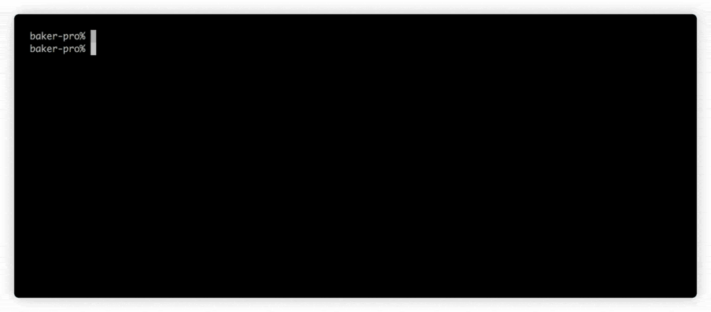
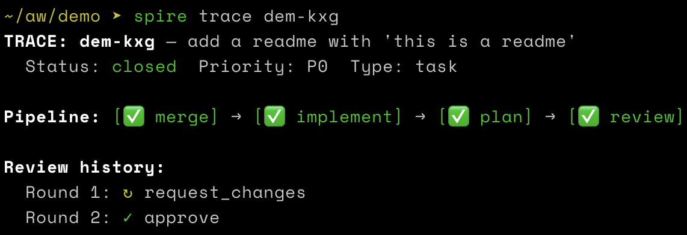

# Spire

A coordination hub for AI agents. File work, let agents execute it, and review what lands.



Spire turns an engineer into the archmage of a tower — you write specs, file work, and review what agents produce. The tower handles execution: the steward dispatches, wizards orchestrate, apprentices implement, sages review, and approved changes land on your repo's base branch. You don't write the code. You steer. You review. You make the architecture calls.

## The roles

| Role | What | Entry point |
|------|------|-------------|
| **Archmage** | You. Writes specs, files work, reviews code, makes architecture calls. | — |
| **Steward** | Global coordinator. Capacity planning, scheduling, dispatches wizards to ready beads. | `spire steward` |
| **Wizard** | Per-bead orchestrator. Driven by a formula (e.g. `spire-bugfix`, `spire-epic`). Dispatches apprentices and sages, seals the work. | `spire summon N` |
| **Apprentice** | Per-subtask implementer. Writes code in an isolated worktree. One-shot, pure implementer. | dispatched by wizard |
| **Sage** | Per-review agent. Reviews implementation against the spec, produces a verdict. One-shot. | dispatched by wizard |
| **Artificer** | Formula maker. Crafts and tests the formulas (spells) that wizards follow. | `spire workshop` |
| **Familiar** | Per-agent companion. Messaging infrastructure, inbox delivery, health checks. | daemon (local) / container (k8s) |

A wizard is summoned to support a bead. The **formula** (derived from bead type) determines the orchestration: a bug gets `spire-bugfix` (plan → implement → review → merge), a task gets `spire-agent-work` (plan → implement → review → merge), and an epic gets `spire-epic` (design → plan → wave dispatch → review → merge). Same executor, different formula.

## Why Spire

AI agents are powerful but isolated. An agent in your frontend repo doesn't know what the agent in your backend repo is doing. They can't coordinate. They can't share context. They don't learn from each other's work.

Spire connects them through a shared graph — [beads](https://github.com/steveyegge/beads) on a [Dolt](https://github.com/dolthub/dolt) database. Agents register, communicate, track work, and stay in sync. The steward assigns work. Sages review it. Everything is versioned, queryable, and durable.

The result: you go from managing one agent at a time to managing a team.

## Prerequisites

Before setting up Spire, you'll need:

| Requirement | Purpose | How to get it |
|-------------|---------|---------------|
| `claude` CLI | Runs agent sessions | Install via `npm install -g @anthropic-ai/claude-code` |
| Anthropic API key | Powers agent LLM calls | [console.anthropic.com](https://console.anthropic.com) |
| GitHub token (PAT or SSH key) | Repo operations (clone, branch, push) | GitHub → Settings → Developer settings |
| DoltHub account (free) | Remote sync of bead state | [dolthub.com](https://www.dolthub.com) |

## Quick start

```bash
# Install
brew tap awell-health/tap && brew install spire

# Set credentials
spire config set anthropic-key sk-ant-...
spire config set github-token ghp_...
spire config set dolthub-user myuser
spire config set dolthub-password mypassword

# Create a tower and register your repo
spire tower create --name my-team
cd my-project && spire repo add
# repo add bootstraps required custom bead types like `design`

# Start services (dolt server + daemon)
spire up

# File some work
spire file "Add user authentication" -t feature -p 1

# Summon wizards (agents that will claim and execute ready work)
spire summon 3

# Watch them work
spire watch
```

The default local path is process-based: `spire summon` starts executor processes on your laptop, and approved work is landed by merging to the repo's base branch.

Every step is traceable — `spire trace` shows the full execution DAG for any bead:



### The formula lifecycle

The primary onboarding story for non-trivial work is: **design → plan → implement → review → merge**.

```bash
# 1. Design: create a design bead to capture intent before filing tasks
spire design "Auth system design"

# 2. Add tasks under the epic
spire file "Implement OAuth2" -t task -p 2 --parent spi-abc
spire file "Add MFA support" -t task -p 2 --parent spi-abc
bd dep add spi-abc.2 spi-abc.1    # MFA depends on OAuth2

# 3. Summon capacity — wizards claim ready beads and drive them through
#    plan → implement → review → merge using the bead's formula
spire summon 3

# 4. Watch the board: Ready → Working → Review → Merged
spire board --epic spi-abc
```

Wizards orchestrate the full lifecycle. You don't need to drive each step manually.

See the [epic formula diagram](docs/epic-formula.md) for a visual walkthrough of how an epic moves through design → plan → implement → review → merge.

## The archmage's toolkit

### See what's happening

```bash
spire board                  # interactive board TUI
spire board --json           # machine-readable board for agents/scripts
spire board --epic spi-x2mk  # scoped to one epic
spire watch                  # live tower status
spire watch spi-x2mk         # live epic progress with countdown
spire roster                 # work grouped by epic, plus underlying agent processes
```

### Manage capacity

```bash
spire summon 3               # conjure 3 wizards
spire summon --targets spi-x2mk,spi-x2mk.1  # run exact bead IDs
spire dismiss 1              # send one home
spire roster                 # check capacity
```

### File and structure work

```bash
spire file "Auth system overhaul" -t epic -p 1
spire file "Add OAuth2" -t task -p 2 --parent spi-abc
spire file "Add MFA" -t task -p 2 --parent spi-abc
bd dep add spi-abc.2 spi-abc.1    # MFA depends on OAuth2
```

### Alert and communicate

```bash
spire alert "Check the OAuth implementation" --ref spi-abc.1 --type review -p 1
spire send spi-abc.1 "use the REST API, not GraphQL"   # message a wizard
```

## Metrics

Spire measures every phase of a wizard's lifecycle:

```
filed → queued → startup → working → review → merged
```

This gives you [DORA metrics](https://dora.dev) out of the box:

| DORA metric | Spire equivalent |
|-------------|-----------------|
| Deployment frequency | Beads merged per day |
| Lead time | Filed → merged |
| Change failure rate | Failed runs / total |
| Time to restore | Failed → next success |

Two thresholds keep wizards honest:

```yaml
# spire.yaml
agent:
  stale: 10m      # warning — wizard exceeded guidelines
  timeout: 15m    # fatal — tower kills the pod
```

```bash
spire metrics              # summary: today + this week
spire metrics --model      # cost breakdown by model
```

See [docs/metrics.md](docs/metrics.md) for the full metrics reference.

## Configuration

Each repo has a `spire.yaml` that tells wizards how to work:

```yaml
runtime:
  language: typescript
  install: pnpm install
  test: pnpm test
  build: pnpm build
  lint: pnpm lint

agent:
  backend: process
  model: claude-sonnet-4-6
  max-turns: 30
  stale: 10m
  timeout: 15m

branch:
  base: main
  pattern: "feat/{bead-id}"
```

`pr:` settings still exist in the schema for GitHub-oriented workflows, but the default local executor path lands approved work directly onto `branch.base`.

### Services

```bash
spire up              # start dolt server + daemon (Linear sync, webhook processing)
spire up --steward    # also start a steward process for automatic assignment
spire down            # stop daemon (dolt keeps running)
spire shutdown        # stop everything (daemon + dolt)
spire status          # check what's running
```

`spire up` without `--steward` starts infrastructure only — you manage capacity manually with `spire summon`. Add `--steward` to run the coordinator loop as a separate sibling process. Process mode is the default execution backend for local agents, and `spire summon` remains the primary local capacity control.

## Kubernetes

Spire runs on k8s for production workloads. The steward runs alongside the operator, and wizards run as one-shot pods handling all workload types (tasks, epics, reviews).

```bash
# Deploy to minikube
k8s/minikube-demo.sh

# Or manually
kubectl apply -f k8s/namespace.yaml
kubectl apply -f k8s/crds/
kubectl apply -f k8s/steward.yaml
```

See [docs/k8s-architecture.md](docs/k8s-architecture.md) for the full deployment guide.

## Architecture

```
spire/
├── cmd/spire/             # CLI: board, roster, summon, watch, steward, etc.
├── cmd/spire-sidecar/     # Familiar: health, messaging, status endpoint
├── operator/              # k8s operator: pod lifecycle, workload assignment
├── pkg/metrics/           # Agent run recording
├── pkg/repoconfig/        # spire.yaml reader
├── k8s/                   # Manifests, CRDs, entrypoints
├── agent-entrypoint.sh    # Wizard pod lifecycle
├── docs/
│   ├── getting-started.md # Laptop setup, first task, first landed change
│   ├── cli-reference.md   # All commands documented
│   ├── spire-yaml.md      # spire.yaml configuration reference
│   ├── agent-development.md # Build custom agents
│   ├── cluster-deployment.md # Kubernetes deployment guide
│   ├── troubleshooting.md # FAQ and common fixes
│   ├── metrics.md         # Metrics reference
│   ├── k8s-architecture.md
│   └── superpowers/specs/ # Design documents
└── spire.yaml             # This repo's agent config
```

| Component | Technology | Role |
|-----------|-----------|------|
| CLI | Go (stdlib) | Single CLI surface — all commands |
| Database | [Dolt](https://github.com/dolthub/dolt) | Git-native SQL — versioned state |
| Work tracking | [beads](https://github.com/steveyegge/beads) | Dependency-aware, agent-optimized |
| Review | Claude Opus (1M context) | Spec-aware code review |
| Orchestration | Kubernetes | Pod lifecycle, scaling |

## The shift

Six months ago you wrote code all day. Now you write specs, review landed changes, and steer agents. You didn't become a manager — you became a technical director. You still understand every line. You still catch bugs in review. You still make the architecture calls. But your hands are on the steering wheel, not the keyboard.

Spire is the operating system for that shift.

## Contributing

See [CONTRIBUTING.md](CONTRIBUTING.md) for development setup and contribution workflow.

## License

[Apache License 2.0](LICENSE)
