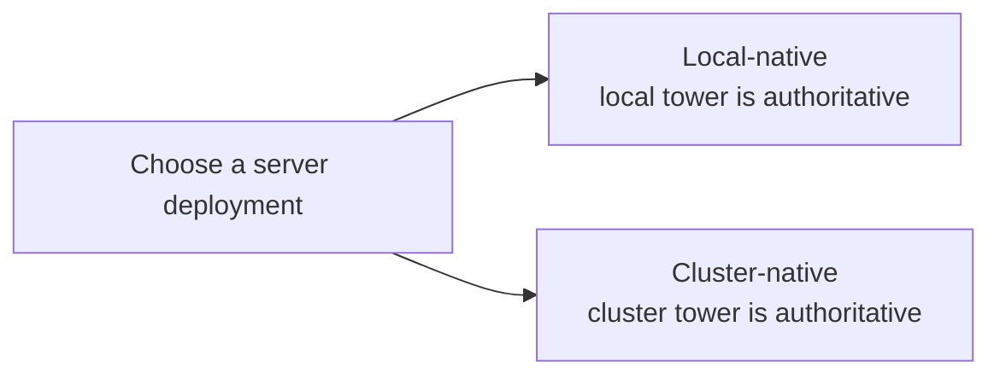
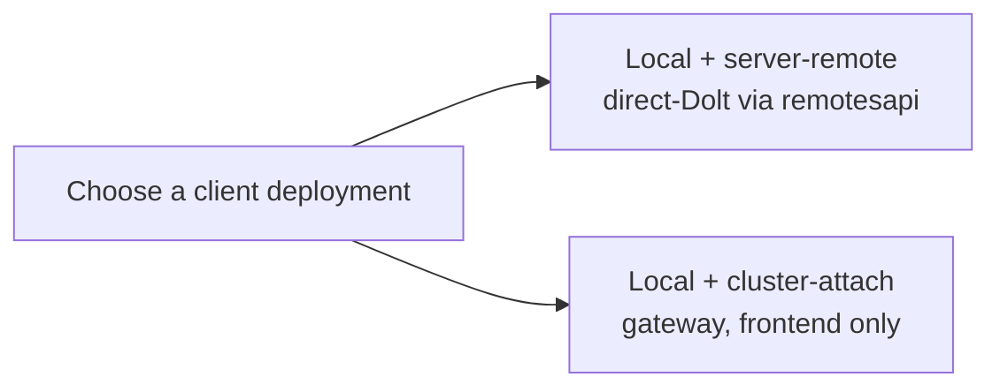
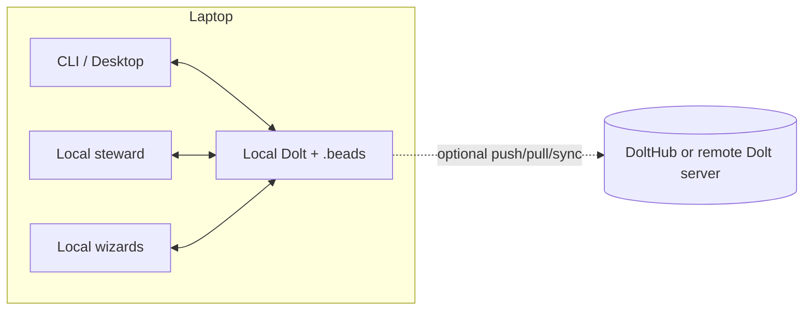
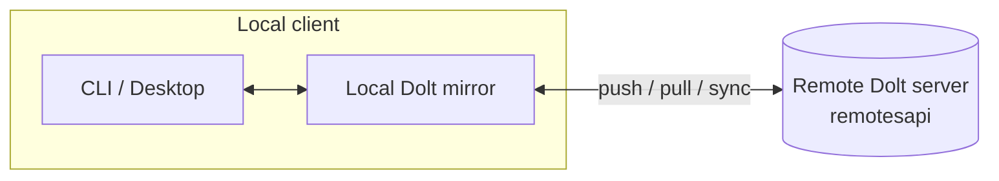
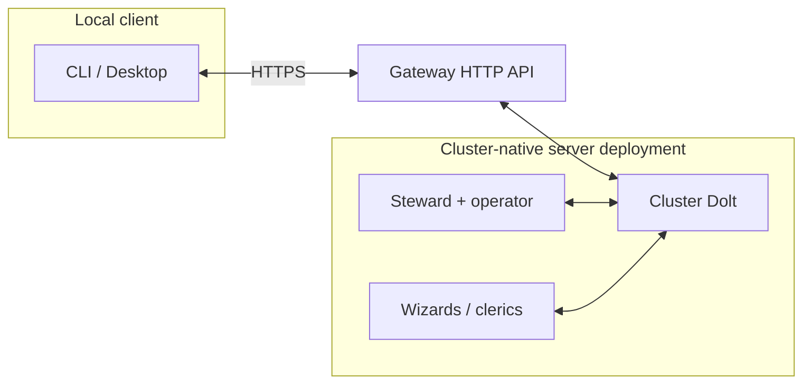

# Deployment Modes

This document separates two choices that were getting mixed together:

1. **Server deployment** — where the authoritative tower lives, and where
   execution happens.
2. **Client deployment** — how a local CLI/Desktop instance connects to
   that tower.

> **Cluster-native is the server deployment family; cluster-as-truth is
> one operating mode within that family.** A cluster-native tower can
> be operated as cluster-as-truth (single-writer, gateway-attached
> clients only) *or* in a direct-Dolt configuration where laptops keep
> writable local mirrors and reach the cluster's Dolt over remotesapi.
> The two are different operating policies under the same server
> deployment family — not different server families. Pick the operating
> policy explicitly; client topology follows from it.

Use this as the operator-facing source of truth when you need to answer
"what is running where?" or "should this client sync, or just act as a
frontend?"

## The two decisions

### 1. Server deployment

- **Local-native** means the local machine owns the tower, the steward,
  and the workers.
- **Cluster-native** means the cluster owns the tower, the control
  plane, and the worker execution surface.

### 2. Client deployment

> "Cluster-attach" in this document always means **gateway attach**.
> A laptop talking to a cluster's Dolt over `remotesapi` is in the
> `server-remote` topology, not `cluster-attach`. The naming is the
> bright line between the two operating modes a cluster-native server
> deployment can run in.

- **Local + server-remote (direct-Dolt via remotesapi)** keeps a local
  Dolt mirror and uses `push` / `pull` / `sync` against a remote Dolt
  server. The transport is typically `remotesapi`, but it could also
  be DoltHub.
- **Local + cluster-attach (gateway)** does not keep a writable local
  mirror for the tower. The client talks to the gateway over HTTP and
  acts as a frontend only. Used when the server deployment is
  cluster-native operated as cluster-as-truth.

## Canonical topologies

### A. Local-native

Everything lives on one machine. Sync is optional because the local
tower is authoritative.

Rules:

- Local machine is the source of truth.
- Local Dolt is required.
- `push` / `pull` / `sync` are allowed.

### B. Local + server-remote

This is the direct-Dolt client shape. The laptop keeps a local mirror
and syncs it with a remote server.

Rules:

- Local client keeps a local mirror.
- Client-side sync is part of the model.
- A local Dolt server may still be running on the laptop.
- The remote server may be used mainly for storage, auth, and shared
  state.

### C. Cluster-native (cluster-as-truth) + cluster-attach (gateway)

This is the cluster-as-truth operating mode of cluster-native. The
cluster owns the tower as a single writer and the local machine is
only a frontend.

Rules:

- Cluster is the source of truth.
- No local writable tower mirror is required.
- No client `push` / `pull` / `sync`.
- No local Dolt server is required just to use the tower.

## The important distinction

`server-remote` and `cluster-attach` are **not** the same thing.

- If a client needs `push` / `pull` / `sync`, it is in a
  **server-remote** topology.
- If a client is attaching to a **cluster-as-truth** tower, it
  **must** use **cluster-attach / gateway mode**. Server-remote attach
  to a cluster-as-truth tower is unsupported — it would mint a second
  writer and violate the single-writer invariant the cluster is
  enforcing.

### Supported / unsupported matrix

| Server deployment | Client topology | Status |
|-------------------|-----------------|--------|
| Local-native | (no client — local-only) | Supported |
| Local-native | Local + server-remote (peer / DoltHub mirror) | Supported |
| Cluster-native (direct-Dolt) | Local + server-remote (remotesapi to cluster Dolt) | Supported |
| **Cluster-native (cluster-as-truth)** | **Local + cluster-attach (gateway)** | **Supported — required for this server topology** |
| Cluster-native (cluster-as-truth) | Local + server-remote (remotesapi to cluster Dolt) | **Unsupported.** Mints a second writer; the cluster's single-writer invariant rejects it. |
| Cluster-native (any) | Attached-reserved | Reserved — not implemented (see [attached-mode.md](attached-mode.md)) |

If the cluster operator has chosen cluster-as-truth, every client
attaches via the gateway. If the operator has chosen a direct-Dolt
cluster topology, every client attaches via remotesapi as
`server-remote`. Operators do not mix the two against the same tower.

## Summary table

| Topology | Authoritative tower | Local Dolt mirror | Client sync | Local Dolt server needed |
|----------|---------------------|-------------------|-------------|--------------------------|
| Local-native | Laptop | Yes | Optional | Usually yes |
| Local + server-remote (direct-Dolt via remotesapi or DoltHub) | Remote Dolt server | Yes | Yes | Often yes |
| Cluster-native (cluster-as-truth) + cluster-attach (gateway) | Cluster | No | No | No |

## Current code terms

The user-facing language above maps to the current codebase like this:

- `DeploymentModeLocalNative` — local-native server deployment
- `DeploymentModeClusterNative` — cluster-native server deployment
- `TowerModeGateway` — cluster-attach client mode
- `RemoteKindRemotesAPI` — direct remote Dolt transport used by
  server-remote topologies
