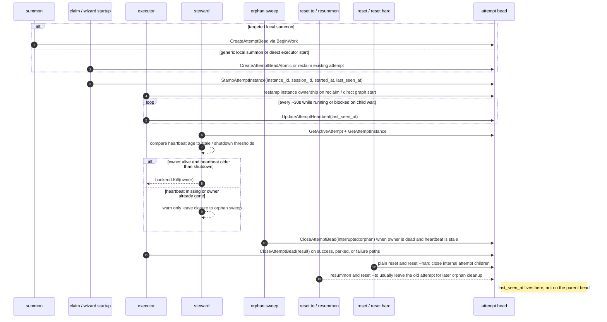

# Attempt Bead Interactions

The attempt bead is the execution lease. If you are asking "who owns this run?" or "is the wizard still alive?", this is the surface that matters.

## Why The Attempt Bead Exists

- It carries execution ownership: which agent owns the run, which instance stamped it, and which branch/model labels describe that run.
- It carries liveness: the steward reads `last_seen_at` from attempt metadata because parent-bead `updated_at` is not a reliable heartbeat.
- It preserves history per run: success, parked, interrupted, and orphaned outcomes belong to attempts, not to the parent bead's one long-lived identity.
