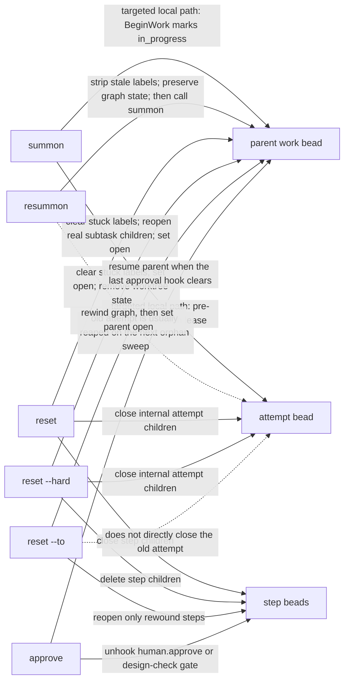
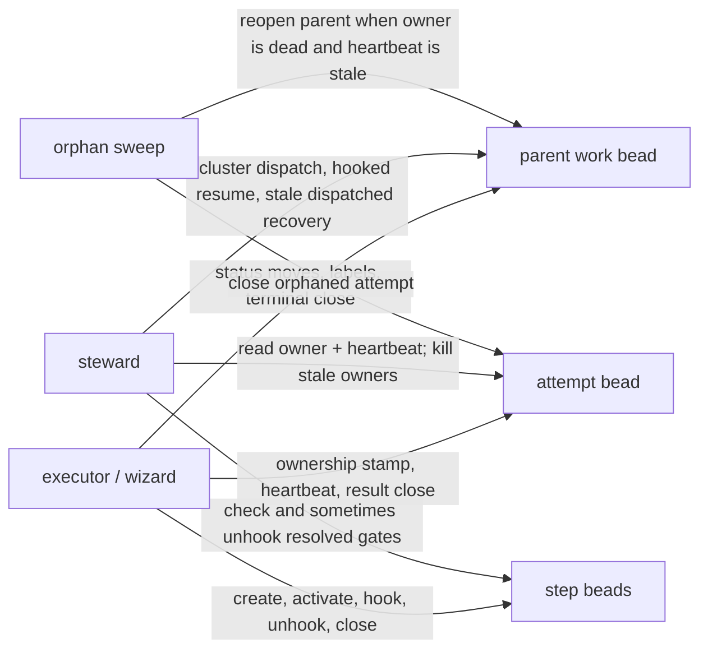
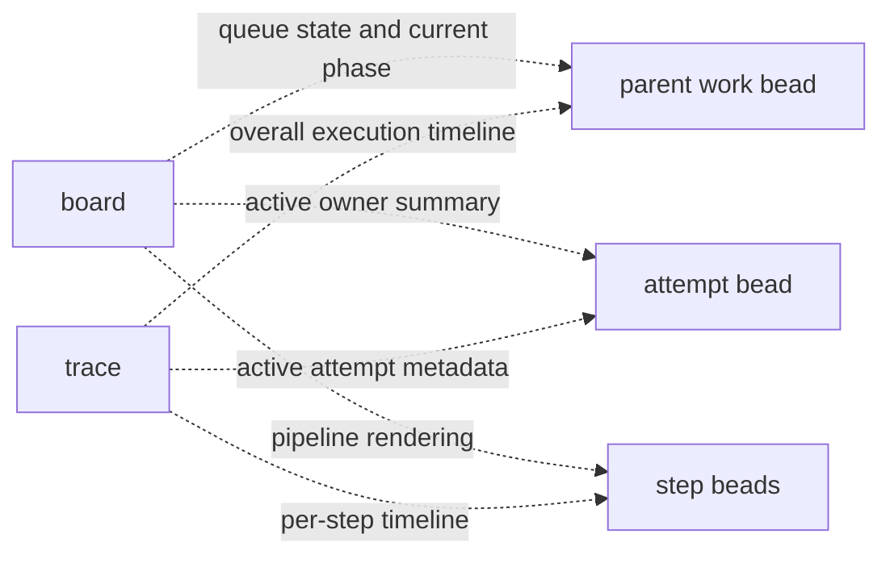

# Bead Surface Overview

This map shows which commands and runtime actors touch the parent bead, the attempt bead, and the step beads. The surface is broken into three diagrams so each category stays readable on its own.

## 1. Operator Commands

Commands the user runs explicitly. Solid arrows are direct writes; dotted arrows are indirect side effects.

## 2. Runtime Actors

Background processes that mutate beads as work progresses.

## 3. Read-Only Surfaces

UI surfaces that only read bead state — they never mutate it.

## Why These Surfaces Exist

- The parent bead is the user-facing work item: queue state, ownership visibility, board actions, and terminal completion all land here.
- The attempt bead is the execution lease: instance ownership, heartbeat, and attempt result belong here, not on the parent bead.
- The step beads are the external pipeline surface: they make graph progress visible to board and trace without making the UI parse graph state files.
