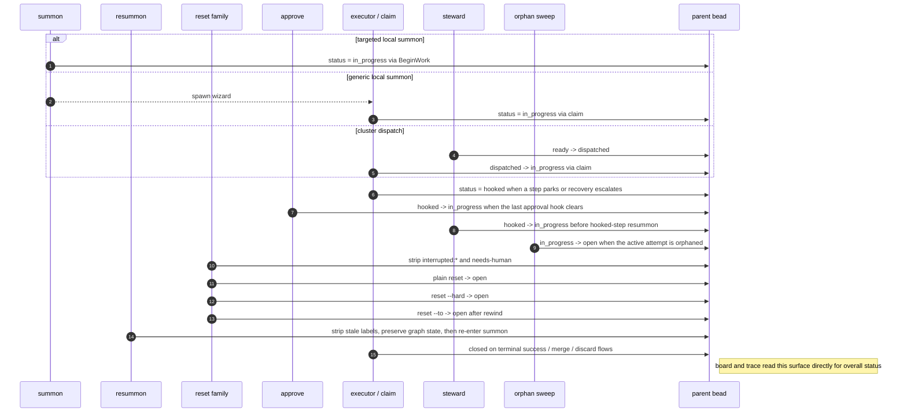

# Parent Bead Interactions

The parent bead is the overall task lifecycle surface. It is what commands, steward policy, and the UI treat as "the work item."

## Why The Parent Bead Exists

- It is the queueing and operator surface: `ready`, `dispatched`, `in_progress`, `hooked`, `open`, and `closed` all describe the work item as a whole.
- Commands like `summon`, `resummon`, `reset`, and `approve` act on the parent bead because they are steering the task, not just one execution lease or one formula step.
