# Epic Formula Lifecycle

The `epic-default` formula drives an epic bead through five phases. The **wizard** (per-epic orchestrator) owns the lifecycle and dispatches specialized agents for each phase.

```mermaid
flowchart TD
    start([spire summon]) --> design

    subgraph design ["Phase 1: Design Validation"]
        direction TB
        d1[Wizard checks for linked<br/>design bead via ref: label]
        d1 -->|found & closed| d2[Design validated ✓]
        d1 -->|missing or open| d3[Label needs-design<br/>Message archmage]
        d3 -->|blocked| d3
    end

    design --> plan

    subgraph plan ["Phase 2: Plan"]
        direction TB
        p1[Wizard invokes Claude Sonnet<br/>with design context]
        p1 --> p2[Claude generates subtask<br/>breakdown with deps]
        p2 --> p3[Subtasks filed as child beads<br/>Dependencies wired]
    end

    plan --> implement

    subgraph implement ["Phase 3: Implement (Wave Dispatch)"]
        direction TB
        i0[Compute waves from<br/>subtask dependency graph]
        i0 --> i1

        i1[Create staging branch<br/>epic/bead-id]
        i1 --> wave

        subgraph wave ["For each wave"]
            direction TB
            w1[Spawn apprentices in parallel<br/>one per subtask, each in a worktree]
            w1 --> w2[Wait for all apprentices]
            w2 --> w3[Merge child branches<br/>into staging branch]
            w3 --> w4{Merge conflict?}
            w4 -->|yes| w5[Claude resolves conflicts]
            w5 --> w6[Verify build]
            w4 -->|no| w6
        end

        wave --> i2[All waves complete]
    end

    implement --> review

    subgraph review ["Phase 4: Review"]
        direction TB
        r1[Dispatch sage<br/>Claude Opus, verdict-only]
        r1 --> r2{Verdict?}
        r2 -->|approved| r3[Label review-approved ✓]
        r2 -->|request changes| r4{Round < max?}
        r4 -->|yes| r5[Spawn review-fix apprentice<br/>Merge fix into staging]
        r5 --> r1
        r4 -->|no| r6[Escalate to arbiter<br/>Claude Opus tie-break]
        r6 --> r7{Arbiter verdict?}
        r7 -->|override approve| r3
        r7 -->|agree reject| r8[Epic blocked ✗]
    end

    review --> merge

    subgraph merge ["Phase 5: Merge"]
        direction TB
        m1[Checkout main]
        m1 --> m2[Merge staging branch → main]
        m2 --> m3{Conflict?}
        m3 -->|yes| m4[Claude resolves]
        m4 --> m5[Push main]
        m3 -->|no| m5
        m5 --> m6[Delete staging branch]
        m6 --> m7[Close bead ✓]
    end

    merge --> done([Epic complete])

    style design fill:#2d1b69,stroke:#7c3aed,color:#e9d5ff
    style plan fill:#1e3a5f,stroke:#3b82f6,color:#dbeafe
    style implement fill:#1a3c34,stroke:#22c55e,color:#dcfce7
    style review fill:#3b2f1e,stroke:#f59e0b,color:#fef3c7
    style merge fill:#3b1f1f,stroke:#ef4444,color:#fee2e2
```



## Roles

| Role | Who | What they do |
|------|-----|-------------|
| **Wizard** | Per-epic orchestrator | Validates design, generates plan, dispatches agents, drives lifecycle |
| **Apprentice** | Implementation agent | Writes code in isolated worktree, one per subtask |
| **Sage** | Review agent | Reviews staging branch, returns verdict (approve / request changes) |
| **Arbiter** | Tie-break agent | Resolves deadlock when sage and apprentice can't converge |

## Formula Configuration

```toml
[phases.design]     # wizard validates linked design bead
[phases.plan]       # wizard invokes Claude to break epic into subtasks
[phases.implement]  # apprentices in parallel waves, staging branch
[phases.review]     # sage with up to 3 revision rounds
[phases.merge]      # auto squash-merge to the configured base branch
```
