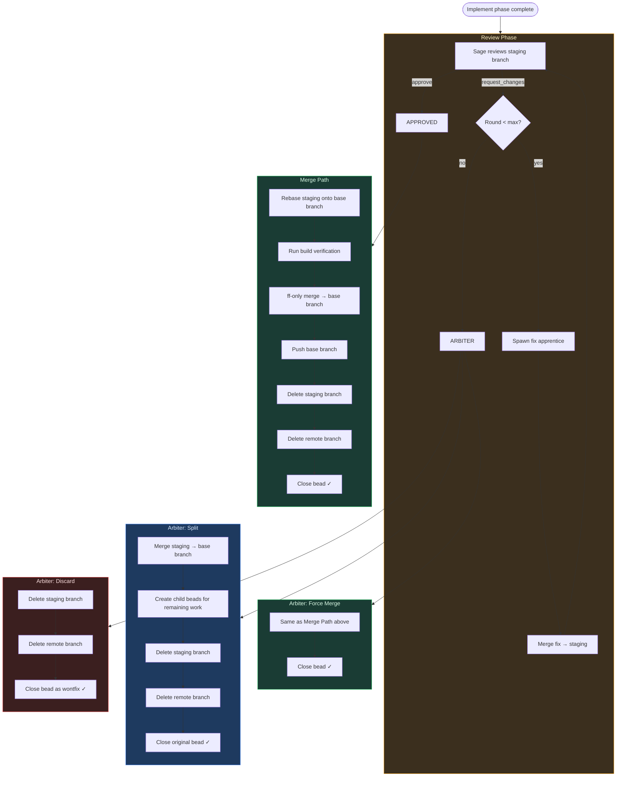

# Review DAG: Every Path Merges or Deletes

The review phase is the most complex part of the formula lifecycle. This
document maps every path through it and enforces a single invariant:

> **Every path ends with the branch either merged to the base branch or deleted.
> No hanging branches. No orphaned code.**

## The DAG



## Terminal states

Every path through the review system ends in one of these states. There
are no others.

| Path | Branch | Bead | Child beads |
|------|--------|------|-------------|
| Sage approves → merge | Merged to base branch, deleted | Closed | — |
| Arbiter: merge | Merged to base branch, deleted | Closed | — |
| Arbiter: split | Merged to base branch, deleted | Closed | Created for remaining work |
| Arbiter: discard | Deleted (not merged) | Closed (wontfix) | — |

### The invariant

```
assert: at exit, branch ∉ {local branches} ∧ branch ∉ {remote branches}
assert: at exit, bead.status == closed
```

No path may close a bead while leaving a branch (local or remote) alive.
No path may delete a branch without closing the bead.

## Path details

### 1. Sage approves

The happy path. Sage reviews the staging branch diff, returns `approve`.

```
sage: approve
  → rebase staging onto base branch
  → build verification (go build / go test)
  → git merge --ff-only staging → base branch
  → git push origin <base-branch>
  → git branch -D staging (local)
  → git push origin --delete staging (remote)
  → close bead
```

### 2. Sage requests changes (within max rounds)

Sage returns `request_changes`. The executor agrees with the feedback
and dispatches a fix apprentice.

```
sage: request_changes (round N < max)
  → executor logs agreement with sage
  → spawn fix apprentice (works on feat/<bead-id>)
  → merge fix branch into staging
  → re-dispatch sage (loop back to review)
```

The fix apprentice gets the sage's feedback in its prompt context.
The loop continues until the sage approves or max rounds is reached.

### 3. Max rounds → arbiter

After `max_rounds` (default 3) review rounds without approval, the
arbiter is invoked. The arbiter is Claude Opus with the full review
history. It makes one of three decisions:

#### 3a. Arbiter: merge (force-approve)

The arbiter decides the code is good enough. Minor remaining issues
are acceptable.

```
arbiter: merge
  → same as "sage approves" path above
  → label: arbiter:merge
```

#### 3b. Arbiter: split

The arbiter decides the work is partially done. Some parts should
ship, others need separate beads. **This is the critical path that
was previously broken — it closed the bead without merging.**

```
arbiter: split
  → merge staging → base branch (the approved work ships)
  → create child beads for remaining work
  → delete staging branch (local + remote)
  → close original bead
  → label: arbiter:split
```

The rationale: the arbiter only says "split" when part of the work is
good. If nothing was good, it would say "discard." Therefore, split
always merges what exists. The child beads are additive — they address
gaps, not replacements for what's on the branch.

#### 3c. Arbiter: discard

The arbiter decides the approach is fundamentally wrong or the task
is no longer needed. Nothing should be merged.

```
arbiter: discard
  → delete staging branch (local + remote)
  → delete remote branch (feat/ or epic/)
  → close bead as wontfix
  → label: arbiter:discard
```

## Branch lifecycle

A branch exists from the moment the implement phase creates it until
the review phase resolves it. At no point should a branch outlive the
bead it serves.

```
implement:  create feat/<bead-id> or epic/<bead-id>
            push to origin

review:     sage reads the branch
            fix apprentices push to the branch
            staging branch accumulates fixes

terminal:   branch is EITHER:
            - merged to the base branch (approve, arbiter:merge, arbiter:split)
            - deleted without merge (arbiter:discard)
            NEVER left hanging.
```

## Error handling

| Failure | Behavior |
|---------|----------|
| Merge conflict during ff-only | Rebase staging onto main, retry merge |
| Build verification fails | Log error, leave bead at review-approved, do NOT delete branch |
| Push to base branch fails | Log error, leave bead at review-approved |
| Branch delete fails | Log warning, continue (non-fatal) |
| Arbiter fails to respond | Default to discard (delete branch, close bead) |

The only case where a branch survives is a build verification failure
after approval. This is intentional — the branch contains approved work
that needs a manual fix, not deletion. The bead stays at `review-approved`
so `spire board` shows it needs attention.

## Stale branch detection

As a safety net, `spire doctor` should detect branches whose beads are
closed:

```
for each local branch matching feat/* or epic/*:
  extract bead-id from branch name
  if bead.status == closed:
    warn: "stale branch {branch} — bead {id} is closed"
    --fix: delete the branch
```

This catches any edge case where a branch leaks through.
