# Wizard Workflow DAG

## Standalone task (bugfix / task / feature)

```mermaid
flowchart TD
    summon([spire summon]) --> spawn[spawn execute]

    spawn --> attempt["🔵 create attempt bead"]
    attempt --> steps["🔵 create step beads<br/>(implement, review, merge)"]

    steps --> impl_start["▶ activate step:implement"]
    impl_start --> apprentice["spawn apprentice<br/>in worktree"]

    subgraph apprentice_work ["Apprentice (isolated worktree)"]
        direction TB
        a1[read prompt + focus context]
        a1 --> a2[claude runs]
        a2 --> a3[validate: lint → build → test]
        a3 --> a4[commit + push branch]
    end

    apprentice --> apprentice_work
    apprentice_work --> impl_done["✅ close step:implement"]

    impl_done --> review_start["▶ activate step:review"]
    review_start --> review_bead["🔵 create review-round-1"]
    review_bead --> sage["dispatch sage<br/>(Opus review)"]

    sage --> verdict{verdict?}

    verdict -->|approve| review_close["✅ close review-round-1<br/>(approve)"]
    review_close --> merge_start

    verdict -->|request_changes| changes["✅ close review-round-1<br/>(request_changes)"]
    changes --> round_check{round < max?}
    round_check -->|yes| fix[spawn fix apprentice]
    fix --> merge_fix[merge fix → staging]
    merge_fix --> review_bead2["🔵 create review-round-2"]
    review_bead2 --> sage2[dispatch sage]
    sage2 --> verdict2{verdict?}
    verdict2 -->|approve| review_close2["✅ close review-round-2"]
    review_close2 --> merge_start

    round_check -->|no| arbiter["🏛️ ARBITER<br/>(Opus tie-break)"]
    verdict2 -->|request_changes round >= max| arbiter

    arbiter --> arb_decision{decision?}
    arb_decision -->|merge| merge_start
    arb_decision -->|split| split["merge staging → base branch<br/>🔵 create child beads<br/>✅ close bead"]
    arb_decision -->|discard| discard["delete branches<br/>✅ close as wontfix"]

    merge_start["▶ activate step:merge"]
    merge_start --> rebase[rebase staging onto base branch]
    rebase --> build_verify[build verification]
    build_verify --> ff[git merge --ff-only → base branch]
    ff --> push_main[push base branch<br/>archmage identity]
    push_main --> delete_branch[delete staging branch]
    delete_branch --> close_merge["✅ close step:merge"]
    close_merge --> close_bead["✅ close bead"]
    close_bead --> close_attempt["✅ close attempt bead"]

    split --> close_attempt2["✅ close attempt bead"]
    discard --> close_attempt3["✅ close attempt bead"]

    build_verify -->|fail| escalate["⚠️ needs-human<br/>alert archmage<br/>leave branch intact"]
    escalate --> close_attempt4["✅ close attempt bead<br/>(result: merge-failure)"]

    style attempt fill:#1e3a5f,stroke:#3b82f6,color:#dbeafe
    style steps fill:#1e3a5f,stroke:#3b82f6,color:#dbeafe
    style review_bead fill:#1e3a5f,stroke:#3b82f6,color:#dbeafe
    style review_bead2 fill:#1e3a5f,stroke:#3b82f6,color:#dbeafe
    style arbiter fill:#3b2f1e,stroke:#f59e0b,color:#fef3c7
    style escalate fill:#3b1f1f,stroke:#ef4444,color:#fee2e2
    style split fill:#1e3a5f,stroke:#3b82f6,color:#dbeafe
    style discard fill:#3b1f1f,stroke:#ef4444,color:#fee2e2
```

## Epic (wave dispatch)

```mermaid
flowchart TD
    summon([spire summon]) --> spawn[spawn execute]

    spawn --> attempt["🔵 create attempt bead"]
    attempt --> steps["🔵 create step beads<br/>(design, plan, implement, review, merge)"]

    steps --> design_start["▶ activate step:design"]
    design_start --> validate_design["check discovered-from deps<br/>for closed design bead"]
    validate_design -->|found| design_done["✅ close step:design"]
    validate_design -->|missing| blocked["⚠️ needs-design<br/>alert archmage<br/>STOP"]

    design_done --> plan_start["▶ activate step:plan"]
    plan_start --> plan_check{children exist?}
    plan_check -->|no| plan_invoke["invoke Claude (Opus)<br/>generate subtask breakdown<br/>file child beads + wire deps"]
    plan_check -->|yes| plan_enrich["enrich subtasks with<br/>file-level change specs"]
    plan_invoke --> plan_done["✅ close step:plan"]
    plan_enrich --> plan_done

    plan_done --> impl_start["▶ activate step:implement"]
    impl_start --> compute_waves["compute waves from<br/>dependency graph"]
    compute_waves --> staging["create staging branch<br/>epic/bead-id"]

    staging --> wave0

    subgraph wave0 ["Wave 0 (parallel)"]
        direction LR
        w0a["🔵 subtask .1<br/>spawn apprentice"]
        w0b["🔵 subtask .2<br/>spawn apprentice"]
    end

    wave0 --> merge_w0["merge child branches<br/>→ staging"]
    merge_w0 --> close_w0["✅ close subtask beads"]
    close_w0 --> wave1

    subgraph wave1 ["Wave 1 (parallel, after wave 0)"]
        direction LR
        w1a["🔵 subtask .3<br/>spawn apprentice"]
        w1b["🔵 subtask .4<br/>spawn apprentice"]
    end

    wave1 --> merge_w1["merge child branches<br/>→ staging"]
    merge_w1 --> close_w1["✅ close subtask beads"]
    close_w1 --> impl_done["✅ close step:implement"]

    impl_done --> review["▶ activate step:review<br/>(same as standalone)"]
    review --> merge["▶ activate step:merge<br/>(same as standalone)"]

    style attempt fill:#1e3a5f,stroke:#3b82f6,color:#dbeafe
    style steps fill:#1e3a5f,stroke:#3b82f6,color:#dbeafe
    style blocked fill:#3b1f1f,stroke:#ef4444,color:#fee2e2
    style wave0 fill:#1a3c34,stroke:#22c55e,color:#dcfce7
    style wave1 fill:#1a3c34,stroke:#22c55e,color:#dcfce7
```

## DAG nodes created per bead

```mermaid
graph TD
    subgraph standalone ["Standalone Task"]
        t1[spi-xxx]
        t1 --> t1a["attempt: wizard-spi-xxx"]
        t1 --> t1s1["step:implement"]
        t1 --> t1s2["step:review"]
        t1 --> t1s3["step:merge"]
        t1 --> t1r1["review-round-1"]
        t1 --> t1r2["review-round-2<br/>(if needed)"]
    end

    subgraph epic ["Epic with 4 subtasks"]
        e1[spi-epic]
        e1 --> e1a["attempt: wizard-spi-epic"]
        e1 --> e1sd["step:design ✓"]
        e1 --> e1sp["step:plan ✓"]
        e1 --> e1si["step:implement"]
        e1 --> e1sr["step:review"]
        e1 --> e1sm["step:merge"]
        e1 --> e1r1["review-round-1"]
        e1 --> e1r2["review-round-2"]

        e1 --> sub1["spi-epic.1"]
        e1 --> sub2["spi-epic.2"]
        e1 --> sub3["spi-epic.3"]
        e1 --> sub4["spi-epic.4"]

        sub1 --> s1a["attempt: apprentice-w0-0"]
        sub1 --> s1s["step:implement"]
        sub2 --> s2a["attempt: apprentice-w0-1"]
        sub2 --> s2s["step:implement"]
        sub3 --> s3a["attempt: apprentice-w1-0"]
        sub3 --> s3s["step:implement"]
        sub4 --> s4a["attempt: apprentice-w1-1"]
        sub4 --> s4s["step:implement"]
    end

    style t1a fill:#1e3a5f,stroke:#3b82f6
    style t1r1 fill:#3b2f1e,stroke:#f59e0b
    style t1r2 fill:#3b2f1e,stroke:#f59e0b
    style t1s1 fill:#1a3c34,stroke:#22c55e
    style t1s2 fill:#1a3c34,stroke:#22c55e
    style t1s3 fill:#1a3c34,stroke:#22c55e
    style e1a fill:#1e3a5f,stroke:#3b82f6
    style e1sd fill:#1a3c34,stroke:#22c55e
    style e1sp fill:#1a3c34,stroke:#22c55e
    style e1si fill:#1a3c34,stroke:#22c55e
    style e1sr fill:#1a3c34,stroke:#22c55e
    style e1sm fill:#1a3c34,stroke:#22c55e
    style e1r1 fill:#3b2f1e,stroke:#f59e0b
    style e1r2 fill:#3b2f1e,stroke:#f59e0b
    style s1a fill:#1e3a5f,stroke:#3b82f6
    style s2a fill:#1e3a5f,stroke:#3b82f6
    style s3a fill:#1e3a5f,stroke:#3b82f6
    style s4a fill:#1e3a5f,stroke:#3b82f6
    style s1s fill:#1a3c34,stroke:#22c55e
    style s2s fill:#1a3c34,stroke:#22c55e
    style s3s fill:#1a3c34,stroke:#22c55e
    style s4s fill:#1a3c34,stroke:#22c55e
```

## Legend

| Color | Bead type | Purpose |
|-------|-----------|---------|
| 🔵 Blue | Attempt bead | Who is working, when they started |
| 🟢 Green | Step bead | Which phase is active |
| 🟡 Orange | Review bead | What the sage said |
| 🔴 Red | Failure/escalation | Needs human attention |
